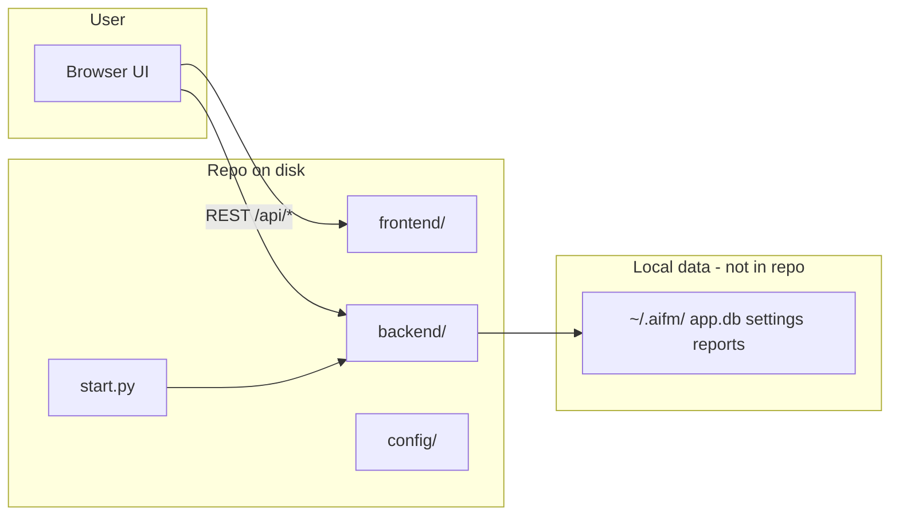
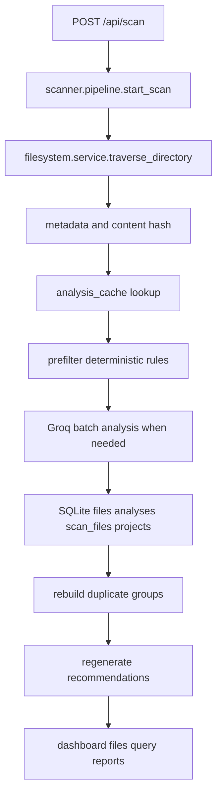
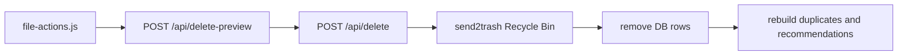
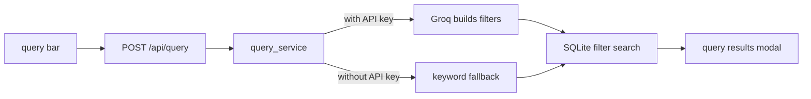

# AI File Manager 2.0 Project Map

This guide is for getting oriented quickly. Start here when you want to know where something lives, then use [Architecture](architecture.md) when you want the stricter layer-by-layer design notes.

## How The App Works In 60 Seconds

AI File Manager is a local desktop-style web app. You run [start.py](../start.py), it initializes the local database, finds an open port from 8000 to 8019, starts the FastAPI server, and opens the browser.

The browser loads the vanilla JavaScript frontend from [frontend/](../frontend/). That UI talks to the backend through `/api/*` routes. When you scan a folder, the backend walks the files, collects metadata, uses simple rules and optionally Groq AI to classify them, saves the results in SQLite, and then powers the dashboard, search, duplicates, reports, and cleanup flows from that local index.

All app data stays on your machine in `~/.aifm/`, not in this repository.



## Directory Map

| Path | What it does |
|------|--------------|
| [start.py](../start.py) | App entry point. Picks a local port, opens the browser, and runs uvicorn. |
| [backend/main.py](../backend/main.py) | FastAPI app factory. Registers the API router and serves the frontend. |
| [backend/api/](../backend/api/) | HTTP route handlers. These are thin modules that validate requests and call services. |
| [backend/api/router.py](../backend/api/router.py) | Collects all API route modules under the `/api` prefix. |
| [backend/services/](../backend/services/) | Business logic for dashboard data, file operations, queries, duplicates, recommendations, and reset. |
| [backend/scanner/](../backend/scanner/) | Scan pipeline: traverse files, estimate cost, prefilter, batch AI calls, persist results. |
| [backend/scanner/pipeline.py](../backend/scanner/pipeline.py) | Main scan orchestrator. |
| [backend/scanner/stages/prefilter.py](../backend/scanner/stages/prefilter.py) | Rule-based classification before AI, such as cache folders, installers, archives, and screenshots. |
| [backend/filesystem/service.py](../backend/filesystem/service.py) | Filesystem gateway. This is the only backend module that should directly read, hash, open, or delete OS files. |
| [backend/providers/](../backend/providers/) | Groq AI implementation. |
| [backend/providers/groq.py](../backend/providers/groq.py) | Groq client for single-file analysis, batch scan analysis, and connection tests. |
| [backend/database/](../backend/database/) | SQLite schema and helper functions. |
| [backend/database/schema.sql](../backend/database/schema.sql) | Tables for files, analyses, scans, duplicates, projects, recommendations, activity, and cache. |
| [backend/cache/analysis_cache.py](../backend/cache/analysis_cache.py) | SQLite-backed analysis cache logic. This is source code, not a temporary cache directory. |
| [backend/models/](../backend/models/) | Dataclasses and Pydantic request/response schemas. |
| [backend/utils/paths.py](../backend/utils/paths.py) | Central path helpers for the project root, frontend directory, and `~/.aifm/` app data. |
| [config/settings.py](../config/settings.py) | Encrypted Groq API key storage and user preferences. |
| [frontend/index.html](../frontend/index.html) | Single-page app shell: sidebar, views, modals, setup, query bar, and toast container. |
| [frontend/scripts/app.js](../frontend/scripts/app.js) | Frontend bootstrap, view routing, global event wiring, setup flow, and theme handling. |
| [frontend/scripts/api.js](../frontend/scripts/api.js) | Central REST client for every `/api/*` call used by the UI. |
| [frontend/scripts/state.js](../frontend/scripts/state.js) | Shared UI state and active view switching. |
| [frontend/scripts/components/ui.js](../frontend/scripts/components/ui.js) | Shared UI helpers such as toasts, modals, donuts, date formatting, and action badges. |
| [frontend/scripts/views/](../frontend/scripts/views/) | One module per major screen or modal workflow. |
| [frontend/styles/](../frontend/styles/) | CSS tokens, layout, components, and view styling. |
| [tests/](../tests/) | Unit and integration tests run with `pytest`. |
| [docs/architecture.md](architecture.md) | Technical architecture reference: layers, data paths, safety, and packaging. |
| [aifm.spec](../aifm.spec) | PyInstaller packaging recipe. Keep this file. |

## I Want To Change X

| Goal | Start here | Notes |
|------|------------|-------|
| Change a UI screen | [frontend/scripts/views/](../frontend/scripts/views/) and [frontend/index.html](../frontend/index.html) | Each sidebar view has a matching `#view-*` container in the HTML. |
| Change navigation or startup UI behavior | [frontend/scripts/app.js](../frontend/scripts/app.js) | Handles init, view changes, setup modal, theme, scan buttons, query bar, and global handlers. |
| Add or call an API endpoint from the UI | [frontend/scripts/api.js](../frontend/scripts/api.js) | Keep fetch/error handling centralized here. |
| Add or change a backend endpoint | [backend/api/](../backend/api/) and [backend/api/router.py](../backend/api/router.py) | Route modules should stay thin and delegate real work to services. |
| Change dashboard numbers | [backend/services/dashboard_service.py](../backend/services/dashboard_service.py) | Most dashboard cards and tables come from SQL aggregations here. |
| Change file list, delete, rename, projects, or duplicates behavior | [backend/services/file_ops_service.py](../backend/services/file_ops_service.py) | This service coordinates DB rows, filesystem actions, cache cleanup, and recommendation rebuilds. |
| Change scan behavior | [backend/scanner/pipeline.py](../backend/scanner/pipeline.py) | This is the main scan flow. Also check `prefilter.py` and `token_budget.py`. |
| Change which files get skipped or classified without AI | [backend/scanner/stages/prefilter.py](../backend/scanner/stages/prefilter.py) | Good place for cheap deterministic rules. |
| Change how files are read, hashed, renamed, or deleted | [backend/filesystem/service.py](../backend/filesystem/service.py) | Keep OS filesystem access concentrated here. |
| Change AI prompts, model calls, or Groq behavior | [backend/providers/groq.py](../backend/providers/groq.py) | Settings and selected models come from [config/settings.py](../config/settings.py). |
| Change the database schema | [backend/database/schema.sql](../backend/database/schema.sql) | Also update any affected SQL in services and tests. |
| Change stored settings or API key handling | [config/settings.py](../config/settings.py) | API keys are encrypted before being saved. |
| Change app startup or packaging behavior | [start.py](../start.py) and [aifm.spec](../aifm.spec) | `start.py` is runtime startup; `aifm.spec` is Windows executable packaging. |

## Frontend View To Backend Flow

| UI area | Frontend loader | API endpoint(s) | Backend area |
|---------|-----------------|-----------------|--------------|
| Dashboard | [dashboard.js](../frontend/scripts/views/dashboard.js) | `/api/dashboard`, `/api/dashboard/*`, `/api/scans` | `dashboard_service` |
| All Files | [files.js](../frontend/scripts/views/files.js) | `GET /api/files` | `file_ops_service` |
| Large Files | [files.js](../frontend/scripts/views/files.js) | `GET /api/files?sort=size_bytes` | `file_ops_service` |
| Recent Files | [files.js](../frontend/scripts/views/files.js) | `GET /api/files?sort=modified_at` | `file_ops_service` |
| Trash | [files.js](../frontend/scripts/views/files.js) | `GET /api/files?action=Delete` | `file_ops_service` |
| Projects | [other.js](../frontend/scripts/views/other.js) | `GET /api/projects` | `file_ops_service` |
| Duplicates | [other.js](../frontend/scripts/views/other.js) | `GET /api/duplicates` plus delete endpoints | `file_ops_service` |
| Reports | [other.js](../frontend/scripts/views/other.js) | `GET /api/reports`, `POST /api/reports` | `backend/api/reports.py` |
| Query history | [other.js](../frontend/scripts/views/other.js) | `GET /api/history` | `backend/api/history.py` |
| New scan modal | [scan.js](../frontend/scripts/views/scan.js) | `/api/browse`, `/api/scan/estimate`, `/api/scan/*` | `pipeline`, `filesystem.service` |
| Query bar | [scan.js](../frontend/scripts/views/scan.js) | `POST /api/query` | `query_service` |
| Delete modal | [file-actions.js](../frontend/scripts/views/file-actions.js) | `/api/delete-preview`, `/api/delete` | `file_ops_service` |
| Settings | [settings.js](../frontend/scripts/views/settings.js) | `/api/settings`, `/api/settings/test`, `/api/reset`, `/api/shutdown` | `config.settings`, `reset_service` |

## Main Backend Data Flows

### Scan



### Delete



### Query



## API Modules At A Glance

| File | Responsibility |
|------|----------------|
| [backend/api/status.py](../backend/api/status.py) | Health, indexed file count, cache count, and public settings snapshot. |
| [backend/api/settings.py](../backend/api/settings.py) | Read, save, and test settings and Groq API connection. |
| [backend/api/browse.py](../backend/api/browse.py) | Browse drives/directories and quick-pick common folders. |
| [backend/api/dashboard.py](../backend/api/dashboard.py) | Dashboard summary, categories, activity, and recommendations. |
| [backend/api/scan.py](../backend/api/scan.py) | Start, estimate, poll, cancel, and list scans. |
| [backend/api/files.py](../backend/api/files.py) | File list plus open and delete preview/execution. |
| [backend/api/projects.py](../backend/api/projects.py) | Detected projects. |
| [backend/api/duplicates.py](../backend/api/duplicates.py) | Duplicate groups. |
| [backend/api/query.py](../backend/api/query.py) | Natural language search. |
| [backend/api/reports.py](../backend/api/reports.py) | Save and list exported JSON reports. |
| [backend/api/history.py](../backend/api/history.py) | Recent activity log. |
| [backend/api/system.py](../backend/api/system.py) | Shutdown and factory reset. |

## Where Data Lives

| Location | Contents |
|----------|----------|
| `~/.aifm/app.db` | Indexed files, analyses, scans, duplicates, projects, recommendations, activity, and cache rows. |
| `~/.aifm/settings.json` | Theme, selected model, and setup state. The API key is encrypted separately. |
| `~/.aifm/.key` | Local encryption key used for saved secrets. |
| `~/.aifm/reports/*.json` | Saved report exports. |
| Repository files | Source code, tests, docs, and packaging instructions only. |

## Common Commands

```bash
pip install -r requirements.txt
python start.py
pytest
pip install pyinstaller
pyinstaller aifm.spec
```

## Things That Are Easy To Confuse

| Item | Keep or delete? | Why |
|------|-----------------|-----|
| [backend/cache/analysis_cache.py](../backend/cache/analysis_cache.py) | Keep | This is cache management source code, not generated cache data. |
| [aifm.spec](../aifm.spec) | Keep | This is the PyInstaller build recipe. |
| [docs/architecture.md](architecture.md) | Keep | This is the technical layer reference; this file is the navigation map. |
| `.pytest_cache/` | Safe to delete | Generated by pytest and recreated automatically. |
| `dist/` and `build/` | Safe to delete locally after packaging | Generated by PyInstaller and already gitignored. |

